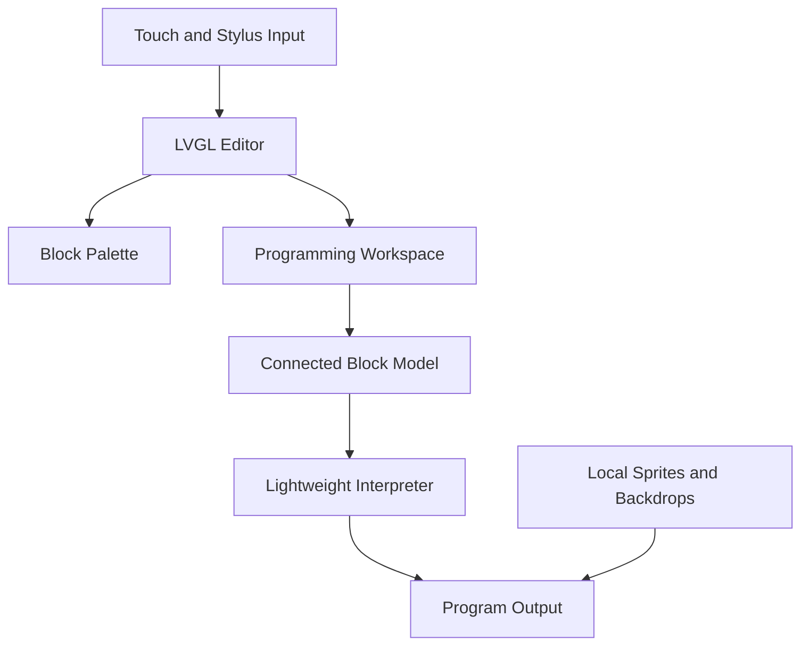

# BitBlocks

**A fully offline block coding environment on a microcontroller class device.**

BitBlocks brings the complete programming cycle onto one small device. Students can create programs, connect blocks, choose sprites and backdrops, run their work, and revise it without a laptop, browser, account, or internet connection. The project is intended for introductory K to 12 computing and for classrooms where access to personal computers may be limited.

BitBlocks is an early prototype. Its current implementation includes a tested desktop editor and an embedded editor running on the target ESP32-S3 touchscreen. The embedded interpreter and complete Play and Stop behavior are still being developed.

  

<em>BitBlocks running directly on the target ESP32-S3 touchscreen device.</em>

## What is BitBlocks?

BitBlocks is a touch based block coding environment. Students browse categorized blocks, drag them into a programming workspace, and snap compatible blocks into connected stacks. Complete stacks can move as a unit. Students can also select local sprites and backdrops, preview a scene, and revise the program on the same device.

The goal is to support an author, run, revise loop without a separate programming host. Unlike an educational microcontroller that receives code from a laptop, BitBlocks places authoring on the ESP32-S3 device itself. The research prototype described in the project paper includes local execution. The current embedded port focuses first on the editor, with its interpreter still in development.

## Why BitBlocks?

Block coding environments usually run on laptops, desktops, or tablets. BitBlocks investigates whether this experience can move to an inexpensive embedded device so each student can create and debug programs directly. The current prototype targets approximately US$20 in core hardware cost, excluding optional SD storage.

This is an access oriented research prototype, not evidence of improved learning outcomes. Classroom usability and learning effects still need formal evaluation.

## Current Features

| Feature | Current behavior |
| --- | --- |
| Block palette | Categorized programming blocks are displayed directly on the touchscreen |
| Touch programming | Blocks can be selected, dragged, placed, and moved with touch or stylus |
| Block connections | Compatible blocks snap into connected stacks |
| Stack movement | Connected blocks move as a unit |
| Events | The editor provides Play, button, screen touch, and message event blocks |
| Movement | Move, turn, position, and direction blocks are available for authoring; embedded execution is in development |
| Control | Wait, repeat, forever, and conditional structures are available; advanced nested execution is deferred |
| Operators | Addition, subtraction, comparison, and random value blocks are available |
| Sprites | A local sprite library can be browsed and selected on the device |
| Backdrops | A local backdrop library can be browsed and selected for program scenes |
| Output preview | The editor displays the selected sprite and backdrop in a dedicated preview area |
| Full output view | The paper prototype supports a larger output view; complete embedded Play behavior is in development |
| Offline operation | Authoring requires no internet connection or second computer after firmware installation |

## BitBlocks Editor

  

<em>BitBlocks editor layout showing the block palette, programming workspace, sprite and backdrop controls, output preview, and run controls.</em>

| Region | Purpose |
| --- | --- |
| Block Palette | Browse available commands by category |
| Programming Workspace | Arrange and connect the program |
| Sprite and Backdrop Controls | Choose the visual objects used by the project |
| Output Preview | See the current scene while editing |
| Run Controls | Start or stop the program when runtime support is available |
| Trash | Remove blocks from the workspace |

## Block Categories

| Category | Color | Purpose |
| --- | --- | --- |
| Movement | Blue | Position and movement commands |
| Events | Yellow | Program, button, message, and touch events |
| Control | Orange | Timing, loops, and conditions |
| Operators | Green | Arithmetic, comparisons, and values |
| Camera | Purple | Visible placeholder category with no current opcodes |

## BitBlocks in action

  

<strong>Watch BitBlocks in action</strong>

The video demonstrates the actual editor on the target device, including stylus input, category browsing, backdrop selection, block placement, and stack connection.

## Hardware

| Component | Specification |
| --- | --- |
| MCU module | ESP32-S3-WROOM-1-N16R8 |
| CPU | ESP32-S3 |
| Flash | 16 MB |
| PSRAM | 8 MB |
| Display | 480 × 320 color TFT with ILI9488 controller |
| Input | Resistive touchscreen and stylus with XPT2046 controller |
| Optional storage | SD card expansion is planned for larger media libraries |

## Software Stack

| Layer | Technology |
| --- | --- |
| Firmware | C++ |
| Framework | Arduino with PlatformIO |
| Embedded UI | LVGL 9.5 |
| Program model | UI independent connected block model |
| Runtime | Lightweight block interpreter in the paper prototype; current embedded port is in development |
| Media | Local sprites and backdrops stored on the device |
| Desktop prototyping | Python with PySide6 |

## System Architecture

The program model is separate from the UI and rendering layers. This keeps connected block data independent of the LVGL editor and supports the lightweight interpreter described in the paper.

## Current Status

The desktop PySide6 prototype implements the editor interactions and media selection workflow. The ESP32-S3 port demonstrates the touch editor on the target hardware. Current embedded work centers on the editor vertical slice. Interpreter execution, full Play and Stop behavior, variables, persistence, advanced nested control, camera blocks, and production media packing remain future work.

Planned research will examine authoring, navigation, error recovery, and classroom usability with novice learners. No learning outcome claims are made at this stage.

## Development Sources

The current BitBlocks implementation and port specification are maintained in the public [BitSlate firmware repository](https://github.com/aranis22/bitslate-firmware). This repository currently provides a focused public overview of BitBlocks rather than a standalone firmware build.
