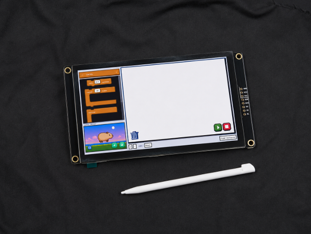
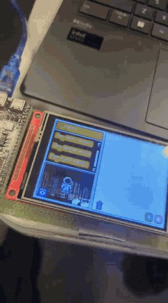
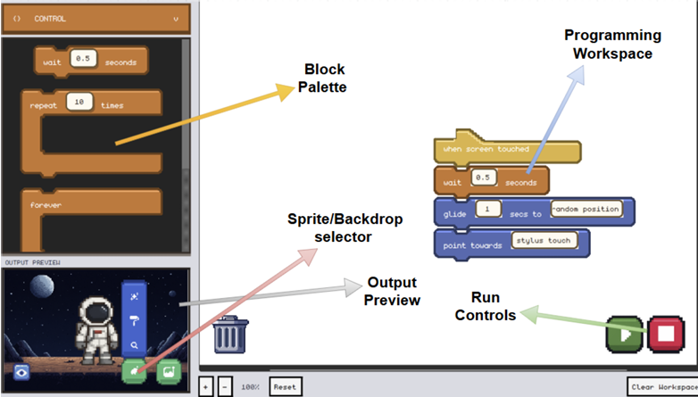
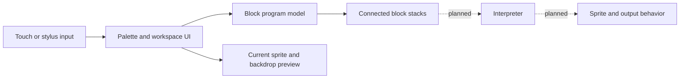

# BitBlocks

**A fully offline, touchscreen block-coding environment that runs directly on an ESP32-S3-class device without requiring a browser, laptop, account, or internet connection.**

BitBlocks is an application within the broader [BitSlate](https://github.com/aranis22/bitslate-firmware) educational-computing project. This repository contains focused public documentation and media for BitBlocks; its implementation is developed in the BitSlate firmware repository.

## Media

<p align="center">
  
</p>

<p align="center"><em>The editor running directly on the target touchscreen hardware.</em></p>

<p align="center">
  
</p>

<p align="center"><em>Animated BitBlocks editor demonstration.</em></p>

<p align="center">
  
</p>

<p align="center"><em>The desktop interaction prototype used to specify the embedded editor.</em></p>

## What it is

BitBlocks explores whether the full authoring loop of introductory block programming can move from a laptop or tablet onto a low-cost embedded device. Students browse blocks, place and connect them in a workspace, choose sprites and backdrops, and preview their scene on the same touchscreen.

The intended use is introductory K–12 computing in classrooms where individual computers, reliable connectivity, or online accounts may not be available. It is an early research prototype, not a finished classroom product, and no learning-outcome claims are made at this stage.

## Implementation sources

The real implementation is split between a tested desktop interaction prototype on BitSlate `main` and a native LVGL port on the BitBlocks feature branches.

| Area | BitSlate source | Role |
| --- | --- | --- |
| Desktop prototype | [`desktop-prototypes/bitslate_blocks/`](https://github.com/aranis22/bitslate-firmware/tree/main/desktop-prototypes/bitslate_blocks) | PySide6 reference implementation for block rendering, workspace interaction, connected stacks, sprites, backdrops, and preview behavior |
| Port contract | [`BITBLOCKS_PORT_SPEC.md`](https://github.com/aranis22/bitslate-firmware/blob/main/BITBLOCKS_PORT_SPEC.md) | Defines the portable model, opcodes, touch behavior, 480×320 layout, lifecycle, and deferred runtime work |
| Embedded application | [`src/apps/bitblocks/`](https://github.com/aranis22/bitslate-firmware/tree/feature/bitblocks-connected-notch/src/apps/bitblocks) | Native C++/LVGL touchscreen editor, media selectors, workspace model, snapping, and launcher integration |
| Embedded media | [`src/assets/UI/bitblocks/generated/`](https://github.com/aranis22/bitslate-firmware/tree/feature/bitblocks-connected-notch/src/assets/UI/bitblocks/generated) | Generated sprite, backdrop, toolbar, and launcher assets used by the firmware build |
| Hardware configuration | [`include/bitslate_config.h`](https://github.com/aranis22/bitslate-firmware/blob/main/include/bitslate_config.h) and [`LGFX_BitSlate.hpp`](https://github.com/aranis22/bitslate-firmware/blob/main/src/hal/display/LGFX_BitSlate.hpp) | Display dimensions, verified pinout, ILI9488 panel, XPT2046 touch, and coordinate correction |

The latest embedded editor work is on `feature/bitblocks-connected-notch`, built on `feature/bitblocks-lvgl-core`. It has not yet been merged into BitSlate `main`.

## Current features

### Implemented in the embedded LVGL editor

- A 480×320 touch-operated editor with a category palette, workspace, output preview, and compact controls.
- Movement, Events, Control, and Operators categories, plus a visible Camera category with no current opcodes.
- Paged palette navigation and clone-on-drag placement from the palette into the workspace.
- Dragging, vertical snapping, predecessor/successor links, and movement of connected block chains.
- A fixed-capacity workspace model supporting up to 24 blocks without unbounded runtime allocation.
- Selection and trash deletion that safely removes a connected chain from the model and view.
- Twelve packaged sprites and eleven packaged backdrops, including paged selectors and random selection.
- Layered sprite/backdrop preview and a full-screen scene view.
- BitSlate launcher registration and application create/destroy lifecycle hooks.

### Implemented in the desktop prototype

- Shared programmatic geometry for stack, event-hat, reporter, and C-shaped blocks.
- Editable argument fields and serializable block models.
- Palette-to-workspace drag and drop, block movement, vertical snapping, and linked-stack movement.
- Delete/Backspace removal, workspace clearing, panning, and zooming.
- Sprite and backdrop selectors that preserve the current editor state.
- Random sprite/backdrop selection and a responsive 3:2 output preview.

### Block catalog

| Category | Implemented authoring blocks |
| --- | --- |
| Movement | Move, turn, go to position, set direction |
| Events | Play clicked, button pressed, screen touched, receive message |
| Control | Wait, repeat, forever, conditional |
| Operators | Addition, subtraction, greater-than comparison, random value |
| Camera | Category and empty state only; camera blocks are planned |

The embedded Play and Stop controls are currently visual UI controls. Program execution, movement simulation, event dispatch, and control-flow interpretation are not yet implemented in the device port.

## Hardware

| Component | BitBlocks dependency |
| --- | --- |
| MCU module | ESP32-S3-WROOM-1-N16R8 |
| Flash | 16 MB |
| PSRAM | 8 MB octal PSRAM |
| Display | 480×320 ILI9488 TFT over SPI |
| Input | XPT2046-compatible resistive touchscreen/stylus on the shared SPI bus |
| Navigation | Active-low Back, Left, and Right buttons in the BitSlate hardware configuration |
| Storage | Firmware and generated static assets in flash; program persistence is not implemented |

The BitSlate hardware layer uses LovyanGFX for the display and touch controller. LVGL receives pointer input through the configured touch callback, including the verified X-axis correction for this prototype.

## Software stack

| Layer | Technology |
| --- | --- |
| Embedded language/framework | C++17 with Arduino |
| Build system | PlatformIO, environment `bitslate_s3` |
| Embedded UI | LVGL 9.5 |
| Display and touch HAL | LovyanGFX 1.2.x |
| Embedded program model | Fixed-capacity `WorkspaceModel` with linked block IDs |
| Desktop prototype | Python and PySide6 |
| Desktop program model | Dataclass-based definitions and serializable block instances |
| Media pipeline | Source PNGs converted to generated LVGL image descriptors |

## Architecture



On the embedded branch, `bitblocks_app.cpp` owns the LVGL screen, touch interaction state, block views, media selectors, and preview. `block_model.h/.cpp` owns a separate fixed-capacity workspace model with block creation, chain linking, detachment, movement, and removal. The BitSlate app registry starts and destroys the BitBlocks leaf application.

The desktop prototype follows the same separation: `palette.py` creates blocks from immutable definitions, `workspace.py` manages placement and snapping, `block_models.py` stores program data, and `block_items.py` renders and moves block views. The future interpreter is intended to consume connected model stacks rather than depend on either UI toolkit.

## Current status

| Area | Status |
| --- | --- |
| PySide6 editor and interaction model | Implemented and covered by prototype tests |
| Embedded LVGL editor | Implemented on the BitBlocks feature branch |
| Touch drag/drop and connected-stack editing | Implemented |
| Sprite/backdrop selection and preview | Implemented |
| Play/Stop and full-screen output controls | UI implemented; execution behavior incomplete |
| Interpreter and local program execution | Planned |
| Variables and project persistence | Planned |
| Advanced nested C-block execution | Planned |
| Camera, Paint, and classroom networking | Planned |
| Production asset packing and memory optimization | In progress |

## Running and building

The implementation currently lives in the BitSlate source repository rather than this documentation repository.

### Desktop interaction prototype

```powershell
git clone https://github.com/aranis22/bitslate-firmware.git
cd bitslate-firmware\desktop-prototypes\bitslate_blocks
py -3 -m venv .venv
.venv\Scripts\Activate.ps1
python -m pip install -r requirements.txt
python main.py
```

The desktop requirements currently specify PySide6 6.7 or newer, below version 7.

### Embedded LVGL editor

Install PlatformIO Core or use the PlatformIO IDE extension, then build the BitBlocks feature branch:

```bash
git clone https://github.com/aranis22/bitslate-firmware.git
cd bitslate-firmware
git switch feature/bitblocks-connected-notch
pio run -e bitslate_s3
```

With the correct serial port selected for the connected BitSlate hardware:

```bash
pio run -e bitslate_s3 -t upload
pio device monitor -b 115200
```

The branch configuration targets `esp32-s3-devkitc-1`, enables octal PSRAM, uses a 16 MB flash layout, and includes `src/apps/bitblocks/**` plus the generated BitBlocks assets in the firmware build.

## Paper

**BitBlocks: A Fully Offline Block-Coding Environment on a Microcontroller-Class Device**

[Read the paper](BitBlocks.pdf)

Conference: SIGCSE Virtual 2026, Poster

